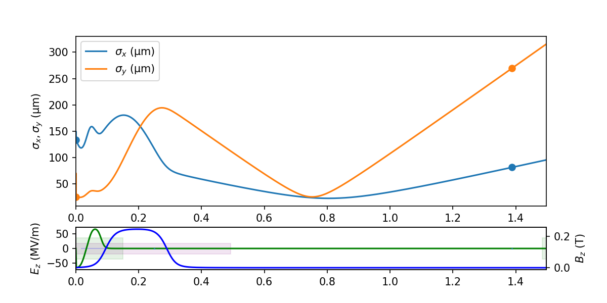
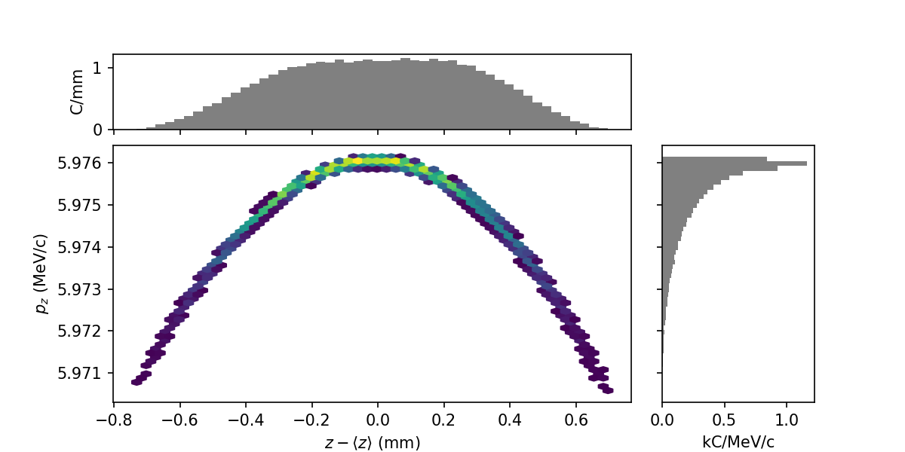

# LUME-Impact
Tools for using Impact-T and Impact-Z in LUME.


**`Documentation`** |
------------------- |
[](https://christophermayes.github.io/lume-impact/)  |


Basic usage:
```python
from impact import Impact

# Prepare Impact object. This will call I.configure() automatically.
I = Impact('/path/to/ImpactT.in', verbose=True)

# Change some things
I.header['Np'] = 10000
I.header['Nx'] = 32
I.header['Ny'] = 32
I.header['Nz'] = 32

# Run
I.run()
...


# Plot the results
I.plot()
```





```python
# Archive all output
I.archive('test.h5')

# Plot particle phase space projection
I.particles['final_particles'].plot('z', 'pz')

```



Current release info
====================

| Name | Downloads | Version | Platforms |
| --- | --- | --- | --- |
| [](https://anaconda.org/conda-forge/lume-impact) | [](https://anaconda.org/conda-forge/lume-impact) | [](https://anaconda.org/conda-forge/lume-impact) | [](https://anaconda.org/conda-forge/lume-impact) |

Installing lume-impact
======================

Installing `lume-impact` from the `conda-forge` channel can be achieved by adding `conda-forge` to your channels with:

```
conda config --add channels conda-forge
conda config --set channel_priority strict
```

Once the `conda-forge` channel has been enabled, `lume-impact` can be installed with:

```
conda install lume-impact
```

It is possible to list all of the versions of `lume-impact` available on your platform with:

```
conda search lume-impact --channel conda-forge
```


# Impact-T Executables

Impact-T is available through conda-forge and can be installed via:
```bash
conda create -n impact
source activate impact # or conda activate impact
# For non-MPI
conda install -c conda-forge impact-t

# For OpenMPI
conda install -c conda-forge impact-t=*=mpi_openmpi*

# For MPICH
conda install -c conda-forge impact-t=*=mpi_mpich*
```
After these steps, the IMPACT-T executable `ImpactTexe` or `ImpactTexe-mpi`, respectively, will be in your [PATH](https://en.wikipedia.org/wiki/PATH_(variable)) environment variable and is thus ready to use like any regular command-line command.


Visit [https://github.com/impact-lbl/IMPACT-T](https://github.com/impact-lbl/IMPACT-T) for these and further instructions, including those to build from source.
