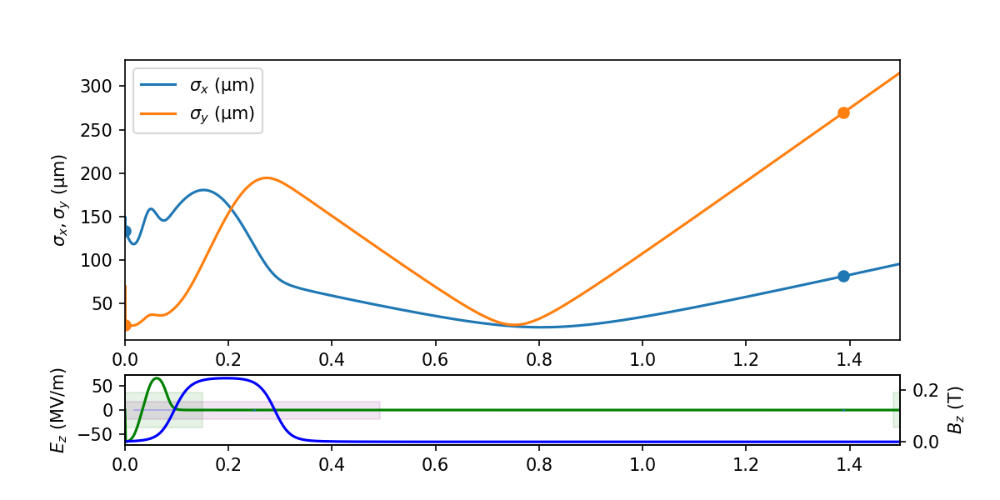

# LUME-Impact

Tools for using IMPACT-T and IMPACT-Z in LUME.

Basic usage:

```python
from impact import Impact

# Prepare Impact object. This will call I.configure() automatically.
I = Impact("/path/to/ImpactT.in", verbose=True)

# Change some things
I.header["Np"] = 10000
I.header["Nx"] = 32
I.header["Ny"] = 32
I.header["Nz"] = 32

# Run
I.run()
...


# Plot the results
I.plot()

```



```python
# Archive all output
I.archive("test.h5")

# Plot particle phase space projection
I.particles["final_particles"].plot("z", "pz")

```


## Current release info

| Name                                                                                                                        | Downloads                                                                                                                       | Version                                                                                                                       | Platforms                                                                                                                       |
| --------------------------------------------------------------------------------------------------------------------------- | ------------------------------------------------------------------------------------------------------------------------------- | ----------------------------------------------------------------------------------------------------------------------------- | ------------------------------------------------------------------------------------------------------------------------------- |
| [](https://anaconda.org/conda-forge/lume-impact) | [](https://anaconda.org/conda-forge/lume-impact) | [](https://anaconda.org/conda-forge/lume-impact) | [](https://anaconda.org/conda-forge/lume-impact) |

## Installing LUME-Impact

Installing `lume-impact` from the `conda-forge` requires adding `conda-forge` to your channels with:

```bash
conda config --add channels conda-forge
conda config --set channel_priority strict
```

Consider also using [Miniforge](https://conda-forge.org/miniforge/) which is a
version of miniconda preconfigured to use `conda-forge`.

Once the `conda-forge` channel has been enabled, `lume-impact` can be installed with:

```bash
# For a non-MPI, single core calculations:
conda create -n impact -c conda-forge lume-impact

# For OpenMPI parallelized calculations:
conda create -n impact -c conda-forge lume-impact impact-t=*=mpi_openmpi* impact-z=*=mpi_openmpi*

# For MPICH parallelized calculations:
conda create -n impact -c conda-forge lume-impact impact-t=*=mpi_mpich* impact-z=*=mpi_mpich*

# And then activate your new environment by way of:
conda activate impact

```

After these steps, the IMPACT-T executable `ImpactTexe` or `ImpactTexe-mpi`,
will be accessible through the conda environment path specified in your
[PATH](<https://en.wikipedia.org/wiki/PATH_(variable)>) environment variable
and is thus ready to use like any regular command-line tool.

LUME-Impact will be accessible in the installed Python environment.

It is possible to list all of the versions of `lume-impact` available on your
platform with:

```bash
conda search lume-impact --channel conda-forge
```

Visit
[https://github.com/impact-lbl/IMPACT-T](https://github.com/impact-lbl/IMPACT-T)
or [https://github.com/impact-lbl/IMPACT-Z](https://github.com/impact-lbl/IMPACT-Z)
for these and further instructions, including those to build from source.
